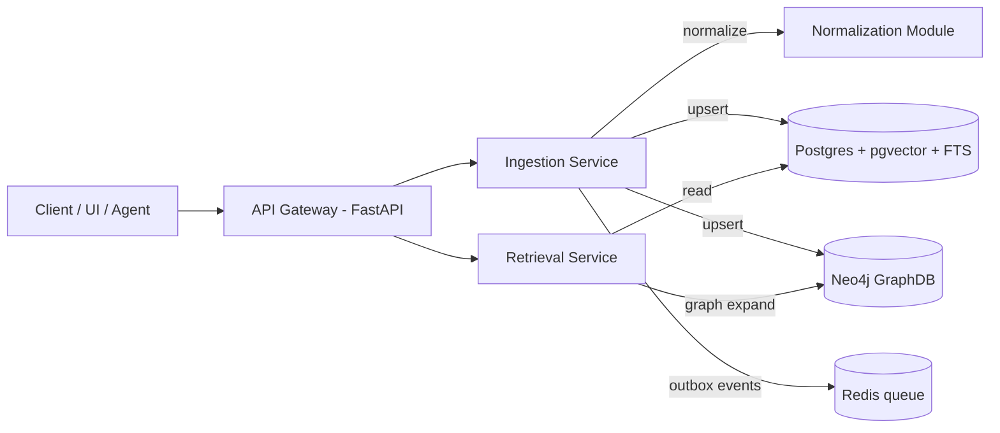

# Knowledge Fusion Retrieval Platform (KFRP)


- Architectural thinking & integration pattern design
- Complex-domain data modeling + normalization
- Retrieval (hybrid + graph expansion) and GraphDB usage
- Diverse API management (gateway + versioned contracts)
- Tradeoff analysis & decision documentation (ADRs)
- Clear communication of technical decisions

> **What this system does:** Ingests documents from multiple “source systems”, normalizes them into a unified domain model, stores relationships in **Neo4j**, stores embeddings + text search in **Postgres (pgvector + FTS)**, and serves a **Hybrid Retrieval API** that can optionally expand results via graph traversal (entity → related entities → evidence).

---


### Architectural thinking
- **Modular monolith vs microservices**: this repo is **service-oriented** but intentionally small—each service is deployable independently, but everything can run in one `docker compose` for demo.
- Clear boundaries: ingestion, normalization, graph, retrieval, gateway.

### Integration patterns
- **Outbox pattern** (reliable event publishing)
- **Idempotency keys** for safe retries
- **Versioned contracts** between services (OpenAPI + JSON schemas)

### Data modeling for complex domains
- Canonical model: `Document`, `Entity`, `Relation`, `SourceRecord`, `NormalizedField`
- Graph model: `(Entity)-[RELATION {confidence, provenance}]->(Entity)` with provenance edges back to `Document`.

### Tradeoffs + decision-making
- See `/docs/adrs/` for concise architecture decisions and why alternatives were rejected.

### Communication
- “Start here” walkthrough + diagrams in `/docs/` + sequence diagrams in the README.

---

## ✅ Quickstart (local)

### 1) Requirements
- Docker Desktop (or Docker Engine)
- Python 3.11+ (only needed if running outside docker)

### 2) Run everything
```bash
docker compose up --build
```

### 3) Try the demo (end-to-end)
```bash
# 1) Ingest a sample “source document”
curl -X POST http://localhost:8080/v1/ingest   -H "Content-Type: application/json"   -d @examples/requests/ingest.sample.json

# 2) Query hybrid retrieval (vector + FTS) with optional graph expansion
curl -X POST http://localhost:8080/v1/query   -H "Content-Type: application/json"   -d @examples/requests/query.sample.json
```

Open docs:
- API Gateway OpenAPI: http://localhost:8080/docs
- Retrieval Service OpenAPI: http://localhost:8002/docs
- Neo4j Browser: http://localhost:7474 (user/pass in compose)

---

## 🧠 System overview

### High-level architecture


### Main request flows
1) **Ingest**: Source → normalize → persist → publish events
2) **Query**: user query → hybrid retrieval → optional graph expansion → response with evidence & provenance

---

## 📁 Repo map 

### Architecture + tradeoffs
- **Architecture overview & diagrams**: [`/docs/architecture.md`](docs/architecture.md)
- **Tradeoffs & decisions**: [`/docs/adrs/`](docs/adrs/)
- **Integration patterns**: [`/docs/integration-patterns.md`](docs/integration-patterns.md)
- **Data model (canonical + graph)**: [`/docs/data-model.md`](docs/data-model.md)

### Code that demonstrates the topics
- API Gateway (versioning, routing, request validation):
  - [`services/api_gateway/app/main.py`](services/api_gateway/app/main.py)
  - [`services/api_gateway/app/routes/v1.py`](services/api_gateway/app/routes/v1.py)
- Ingestion + normalization + idempotency/outbox:
  - [`services/ingestion/app/main.py`](services/ingestion/app/main.py)
  - [`services/ingestion/app/normalization/normalize.py`](services/ingestion/app/normalization/normalize.py)
  - [`services/ingestion/app/outbox/outbox.py`](services/ingestion/app/outbox/outbox.py)
- Retrieval (hybrid search + graph expansion):
  - [`services/retrieval/app/main.py`](services/retrieval/app/main.py)
  - [`services/retrieval/app/retrieval/hybrid.py`](services/retrieval/app/retrieval/hybrid.py)
  - [`services/retrieval/app/retrieval/graph_expand.py`](services/retrieval/app/retrieval/graph_expand.py)
- Schema contracts:
  - [`contracts/v1/`](contracts/v1/)

---

## 🧪 Testing
```bash
docker compose run --rm ingestion pytest
docker compose run --rm retrieval pytest
```

---

## 🧭 Suggested interview walkthrough (5–7 minutes)
1. Start with `/docs/architecture.md` (problem, constraints, components).
2. Point to `/docs/adrs/` (how you make decisions).
3. Show `/docs/data-model.md` (canonical model + graph mapping).
4. Demo `/v1/ingest` and `/v1/query` via curl.
5. Open Neo4j Browser and show a simple `MATCH (e:Entity) RETURN e LIMIT 10`.
6. Mention scalability levers (async ingestion, caches, read replicas, vector index tuning).

---

## License
MIT
